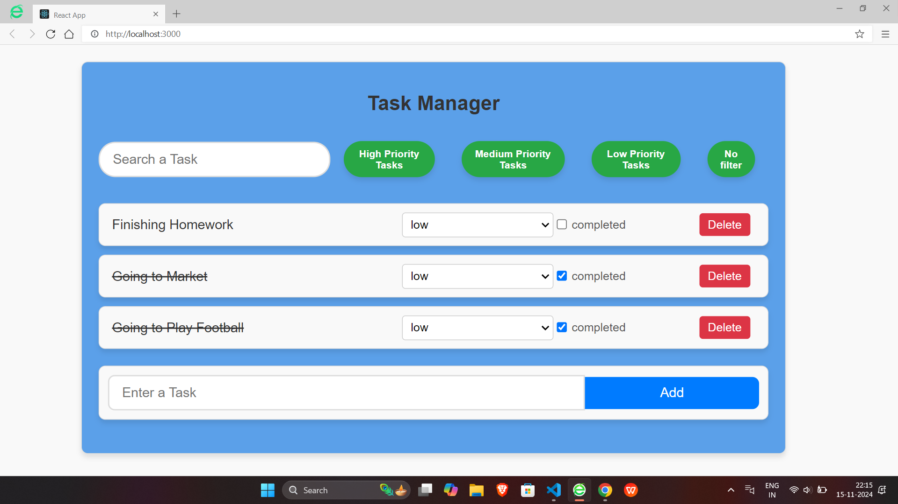

# About the App

This is a Task Manager App built with React in JavaScript

# Basic Features

Adding a Task
Deleting a Task
Setting priority to your task
Changing Completion status of your task
Sorting tasks by various criterias

# Running on your local browser

Fork the repository from Github
Clone it on your local code editor
Then run the following commands
`npm install`
`cd Task-Manager-App`
`npm start`

# Some screenshots

# I have used Framer-motion library for the animations